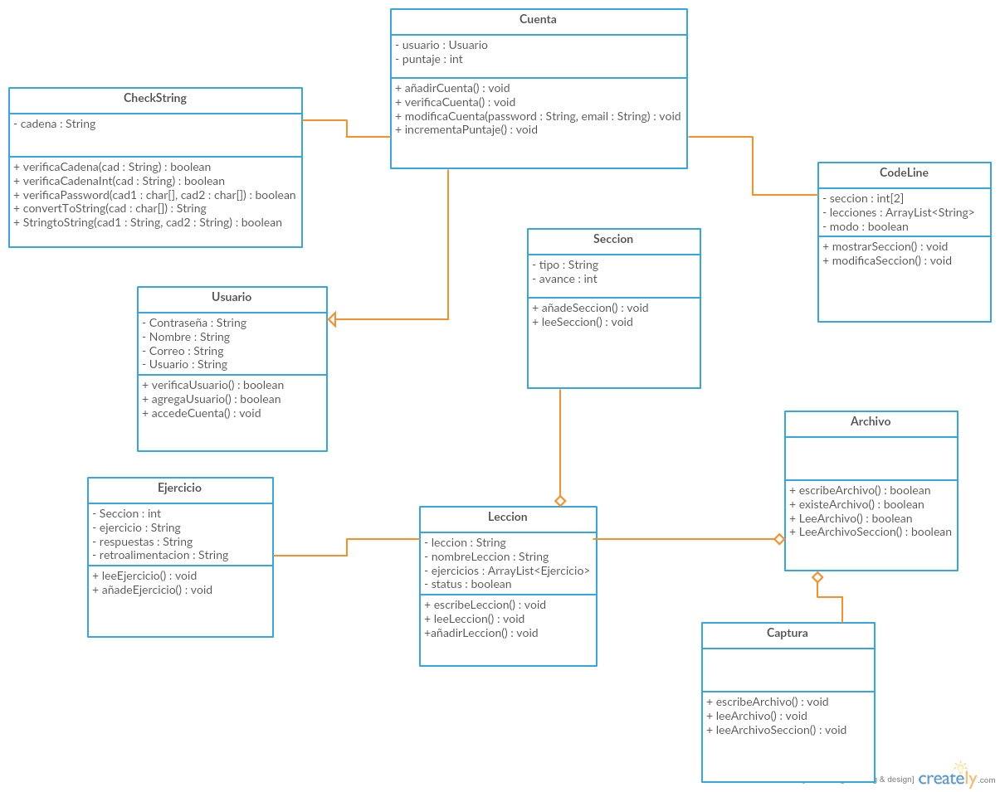

### Objetivo de la aplicación
Fomentar el aprendizaje de lenguajes de programación con el uso de una aplicación en desarrollo. Y así obtener mayor cantidad de personas que programen dispuestos a desarrollar una app genuina e innovadora.

### Descripción de la aplicación
La aplicación que se propone es una app para enseñar a programar desde cero, "lecciones" para programar, pensado para personas que nunca han programado en su vida, de momento la app contará con dos secciones: la primera consiste en aprender a programar sin ningún lenguaje de programación, es decir, programar con pseudocódigo, con el fin de ir preparando la capacidad de programación del usuario para que a continuación pueda aprender un lenguaje en específico; y la segunda sección es aprender un lenguaje de programación en concreto, de momento proponemos que el lenguaje inicial sea C, ya que es un lenguaje sencillo y estructurado que necesita de sintaxis especifica. De este lenguaje solo se planea trabajar lo básico sin llegar a gráficos, debido a que gráficos es más extenso. 
En la app se implementará completar código, para que el usuario desarrolle la habilidad de detectar código más fácilmente, así como también algunos ejercicios que tendrá que resolver para obtener el nivel de conocimiento actual. El usuario contará con la opción de omitir la primer parte, si es que su interés es solo aprender el lenguaje y a programar al mismo tiempo.

### Clases principales y sus características
1. CodeLine
* Nos permite visualizar las lecciones
* Nos brinda la interfaz del usuario
* Nos muestra la sección en la que estamos trabajando

2. Seccion
* Engloba todas las lecciones que pertenecen al modo en específico

3. Cuenta
* Tiene todas las características propias del usuario
* Guarda el puntaje que se obtenga conforme se realizen lecciones

4. Leccion
* Tiene la información de una sola lección
* También tiene los ejemplos necesarios

5. Ejercicio
* Tiene el ejercicio que en cada lección tendra

### Diagrama de clases

### Capturas de pantalla de la aplicación
- Inicio de la aplicación

- Pantalla principal donde se muestran las secciones y ejercicios

- Sección donde se encuentran las lecciones introductorias

- Sección donde se encuentran las lecciones de C

- Lección perteneciente a la sección 1

- Lección perteneciente a la sección 2

- Menu donde se encuentran los ejercicios

- Ejemplo de uno de los ejercicios

### Video(s)
<iframe width="560" height="315" src="https://www.youtube.com/embed/4DlcasayUb4" frameborder="0" allowfullscreen></iframe>

### Archivo Ejecutable
<a href=https://github.com/acominf/CodeLine/releases/download/v1.1/CodeLine.jar>Archivo .jar</a>
<a href=https://github.com/acominf/CodeLine/releases/download/v1.1/srcv1.1.zip>Paquete de archivos src</a>

### Autor(es)
El autor(es) del proyecto son:
- Efraín Emanuel Morín Miranda (@Schneider456)
- Rodrigo Gonzalez Tenorio (@96SparK)

### Materia(s)
- Programación Orientada a Objetos

### Semestre
- 2016-2017/II

### Markdown
El contenido de esta página está escrito en un lenguaje de marcado sencillo llamado *Markdown*. Para más detalles consulta la página de [Markdown para GitHub](https://guides.github.com/features/mastering-markdown/).

### Temas de Jekyll
El estilo y presentación de esta página utiliza el tema de Jekyll seleccionado en la configuración del repositorio. El nombre de este tema está almacenado en el archivo de configuración `_config.yml`. Para más información acerca de los temas de Jekyll soportados por GitHub [haz click en este enlace](https://pages.github.com/themes/).
